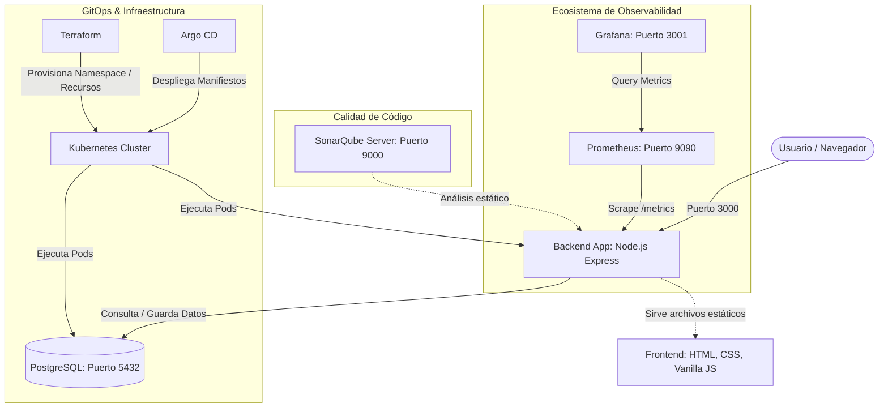

# 🛠️ DracoTech Reparaciones - Portal de Gestión de Servicios Técnicos

¡Bienvenido al repositorio de **DracoTech Reparaciones**! Este proyecto es un portal web dinámico y profesional diseñado para gestionar servicios técnicos, repuestos y control de acceso de usuarios. 

El proyecto cuenta con una arquitectura moderna que integra un backend seguro en **Node.js (Express)**, una base de datos **PostgreSQL**, un ecosistema de observabilidad con **Prometheus y Grafana**, análisis de calidad con **SonarQube**, y una infraestructura automatizada lista para entornos Kubernetes mediante **Terraform y Argo CD (GitOps)**.

---

## 🗺️ Arquitectura del Sistema

El siguiente diagrama muestra cómo interactúan todos los componentes del ecosistema local y de despliegue:



---

## 🚀 Requisitos Previos

Antes de comenzar, asegúrate de tener instalado en tu máquina:

*   [Git](https://git-scm.com/) (para clonar el repositorio)
*   [Docker & Docker Compose](https://www.docker.com/) *(Recomendado para la ejecución rápida)*
*   [Node.js (v16 o superior)](https://nodejs.org/) y `npm` *(Solo si vas a ejecutar de forma local sin Docker)*
*   [Terraform](https://www.terraform.io/) e [kubectl](https://kubernetes.io/docs/tasks/tools/) *(Opcional: solo para despliegues en Kubernetes / GitOps)*

---

## 🛠️ Guía de Ejecución Paso a Paso

Sigue cualquiera de las siguientes opciones de ejecución según tus necesidades:

### 📥 Paso Inicial: Clonar el Proyecto y Configurar el Entorno

1. Abre tu terminal y clona este repositorio:
   ```bash
   git clone https://github.com/vanhelsig34-dot/API-WEB.git
   cd API-WEB
   ```

2. Crea tu archivo de configuración de variables de entorno `.env` copiando el ejemplo base:
   ```bash
   cp .env.example .env
   ```

3. Abre el archivo `.env` y configura tus credenciales personalizadas (o deja las por defecto para pruebas rápidas):
   ```env
   DB_HOST=db
   DB_USER=admin
   DB_PASSWORD=password123
   DB_NAME=techapi_db
   DB_PORT=5432
   GF_SECURITY_ADMIN_PASSWORD=admin
   JWT_SECRET=tu_clave_secreta_super_segura_para_jwt
   ```

---

### 🐳 Método 1: Ejecución Rápida con Docker Compose (Altamente Recomendado)

Esta es la forma más fácil y rápida de ejecutar todo el ecosistema con un solo comando. Docker levantará la base de datos, el backend con el frontend integrado, el sistema de métricas Prometheus, el panel de control Grafana y el servidor de SonarQube de forma automática.

1. Construye e inicia todos los contenedores en segundo plano:
   ```bash
   docker-compose up -d --build
   ```

2. Verifica que todos los servicios estén corriendo correctamente:
   ```bash
   docker-compose ps
   ```

3. **¡Listo!** Ya puedes acceder a los diferentes servicios utilizando tu navegador:

   *   **💻 Portal DracoTech (Frontend + API):** [http://localhost:3000](http://localhost:3000)
   *   **📊 Prometheus Metrics:** [http://localhost:9090](http://localhost:9090)
   *   **📈 Grafana Dashboards:** [http://localhost:3001](http://localhost:3001) *(Dashboard de Node.js pre-provisionado)*
   *   **🔍 SonarQube Server:** [http://localhost:9000](http://localhost:9000)

4. Para detener todos los contenedores y conservar los volúmenes de datos:
   ```bash
   docker-compose down
   ```
   *(Si deseas eliminar también los volúmenes de datos persistentes, ejecuta `docker-compose down -v`)*

---

### 💻 Método 2: Ejecución Local en Modo de Desarrollo (Sin Docker para el Backend)

Si deseas modificar el código del backend o frontend en tiempo real sin tener que reconstruir contenedores Docker, sigue estos pasos:

1. **Levanta únicamente la base de datos** utilizando Docker para evitar configuraciones complejas de Postgres en tu máquina local:
   ```bash
   docker-compose up -d db
   ```

2. Entra en el directorio del backend e instala las dependencias de Node.js:
   ```bash
   cd backend
   npm install
   ```

3. Modifica temporalmente la variable `DB_HOST` en tu archivo `.env` en la raíz del proyecto para que apunte a tu localhost:
   ```env
   DB_HOST=localhost
   ```

4. Ejecuta el servidor de desarrollo:
   ```bash
   npm start
   ```
   El servidor iniciará inmediatamente en el puerto `3000` y sembrará la base de datos automáticamente con usuarios de prueba. Puedes entrar a [http://localhost:3000](http://localhost:3000).

---

### 📊 Monitoreo y Simulación de Tráfico Activo

Una vez que el proyecto esté corriendo (con el Método 1 o el Método 2), puedes probar las herramientas de monitoreo (Prometheus & Grafana) simulando tráfico continuo de usuarios.

1. Abre una nueva terminal en la raíz del proyecto y ejecuta el generador de tráfico sintético:
   ```bash
   node traffic_generator.js
   ```
   Este script comenzará a enviar peticiones `GET` a la raíz y peticiones `POST` de inicio de sesión exitosos y fallidos aleatoriamente.
   
2. Ingresa a **Grafana** ([http://localhost:3001](http://localhost:3001)):
   *   **Usuario:** `admin` | **Contraseña:** la que definiste en `.env` (por defecto `admin`).
   *   Dirígete a la sección de **Dashboards** y selecciona el panel **"Node.js Metrics Dashboard"** pre-provisionado. Verás gráficos interactivos en tiempo real que detallan las peticiones HTTP y el estado del servidor.

---

### ☸️ Método 3: Despliegue en Kubernetes (Entorno de Producción)

El proyecto incluye manifiestos de Kubernetes en la carpeta `k8s/` para desplegar la base de datos (con almacenamiento persistente PVC), el backend, Grafana y Prometheus.

1. Asegúrate de estar conectado a tu clúster de Kubernetes (`kubectl cluster-info`).
2. Crea el namespace del proyecto y aplica todos los manifiestos:
   ```bash
   kubectl create namespace cide-app
   kubectl apply -f k8s/ -n cide-app
   ```
3. Verifica el estado de los recursos creados:
   ```bash
   kubectl get all -n cide-app
   ```

---

### 🤖 Método 4: Infraestructura y Despliegue con Terraform + Argo CD (GitOps)

Si cuentas con una instalación de **Argo CD** en tu clúster de Kubernetes, puedes automatizar todo el aprovisionamiento y despliegue continuo mediante Terraform:

1. Ve a la carpeta de Terraform:
   ```bash
   cd terraform
   ```
2. Inicializa Terraform y descarga los proveedores requeridos:
   ```bash
   terraform init
   ```
3. Revisa y aplica los recursos (esto creará el namespace `cide-app`, los volúmenes y la aplicación dentro de Argo CD automáticamente):
   ```bash
   terraform apply
   ```
4. Abre la consola de Argo CD para ver cómo se sincronizan automáticamente los manifiestos de la carpeta `k8s/` de tu repositorio de Git.

---

## 🔑 Credenciales por Defecto para Pruebas

Para facilitarte el acceso inmediato a la aplicación, la base de datos se siembra automáticamente al iniciar el backend con los siguientes usuarios de prueba (extraídos de [database/user_data.json](database/user_data.json)):

| Aplicación / Servicio | Usuario / Username | Contraseña / Password | Rol / Propósito |
| :--- | :--- | :--- | :--- |
| **Portal DracoTech** | `admin` | `password123` | Administrador |
| **Portal DracoTech** | `tecnico1` | `user2024` | Técnico (Usuario estándar) |
| **Base de Datos (PostgreSQL)** | `admin` | `password123` | DB Admin |
| **Grafana** | `admin` | `admin` *(o tu `.env` password)* | Administrador de Monitoreo |
| **SonarQube** | `admin` | `admin` *(pedirá cambiar al primer inicio)* | Servidor de Análisis Estático |

---

## 🛡️ Medidas de Seguridad Implementadas

Este proyecto no es solo funcional, sino que está protegido bajo estándares profesionales de desarrollo web seguro en el backend (`server.js`):

*   **Helmet.js:** Configura encabezados HTTP seguros para evitar ataques de inyección de scripts (XSS), Clickjacking, etc.
*   **CORS (Cross-Origin Resource Sharing):** Restringe peticiones no autorizadas de orígenes externos.
*   **Express Rate Limit:** Protege las rutas críticas de autenticación (`/login` y `/register`) contra ataques de fuerza bruta, limitando la cantidad de intentos por dirección IP.
*   **XSS-Clean:** Sanitiza las entradas del cuerpo de las peticiones (`req.body`, `req.query`) para neutralizar código malicioso inyectado.
*   **HTTP Parameter Pollution (HPP):** Evita la manipulación de parámetros de consulta repetidos.
*   **Express Validator:** Valida y escapa de forma estricta los caracteres enviados en los formularios.
*   **Encriptación Bcrypt:** Las contraseñas de los usuarios nunca se guardan en texto plano, son procesadas con algoritmos de hashing seguros antes de ser almacenadas en la base de datos.
*   **JSON Web Tokens (JWT):** Manejo de sesiones de usuario seguras y sin estado en el servidor.

---

## 🔍 Análisis de Calidad y Seguridad (SonarQube)

Si deseas realizar un análisis estático de código para verificar la seguridad, bugs o malas prácticas:

1. Asegúrate de que el servicio SonarQube esté corriendo (Método 1).
2. Inicia sesión en [http://localhost:9000](http://localhost:9000) y genera un token o utiliza el token por defecto preconfigurado en `sonar-project.properties`.
3. Ejecuta tu Sonar Scanner local o utiliza la integración de tu CI/CD apuntando al host y puerto `9000` correspondientes. El archivo de propiedades ya excluye automáticamente carpetas irrelevantes como `node_modules`, `terraform` y `k8s`.
